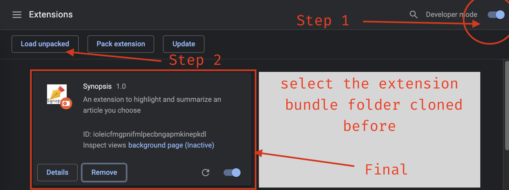
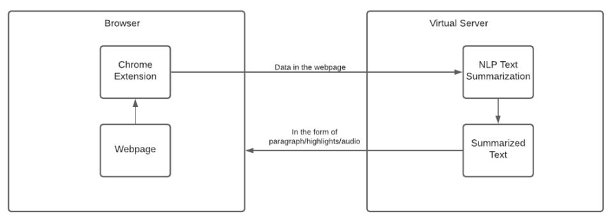
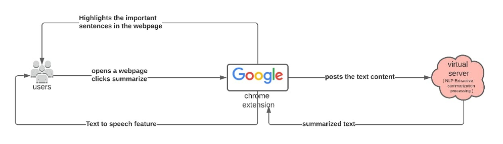
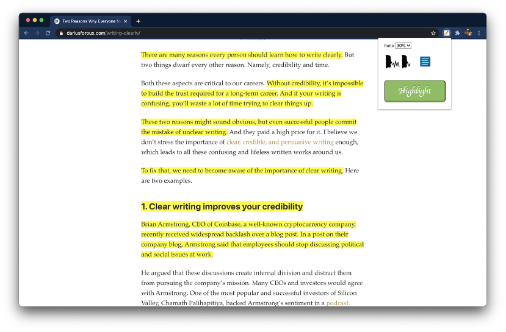
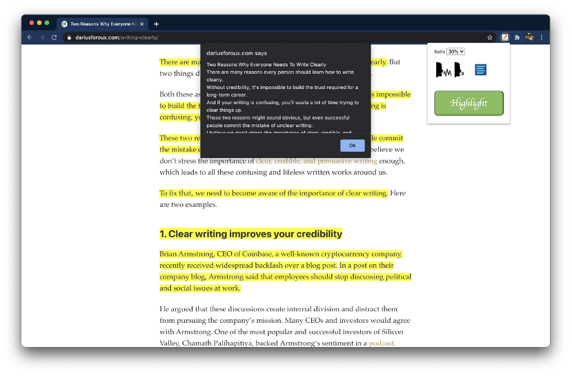

# Synopsis


The purpose of this project is to help users save the effort of going through the entire webpage to gather important information. Since time can never be recreated, it would be beneficial if important points in the webpage could be highlighted, so that the user can skim through the highlights without worrying about missing the essence of the article.


# Usage

1. Clone this repo

```bash

git clone https://github.com/keshavlingala/synopsis-chrome-extension

```
2. Go to chrome://extensions/ in Google Chrome Browser on Desktop



# Working

## Architecture



## UML




# Working Screenshots

## Highlighted Web Page



## Summarized version of Article

